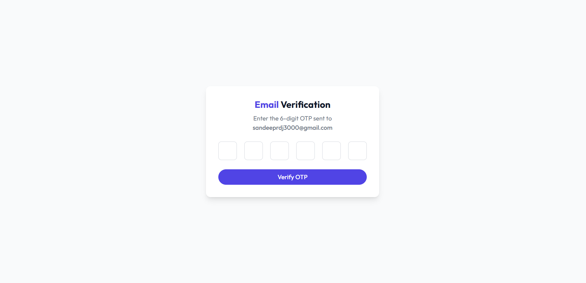
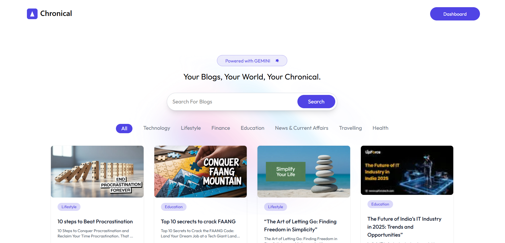
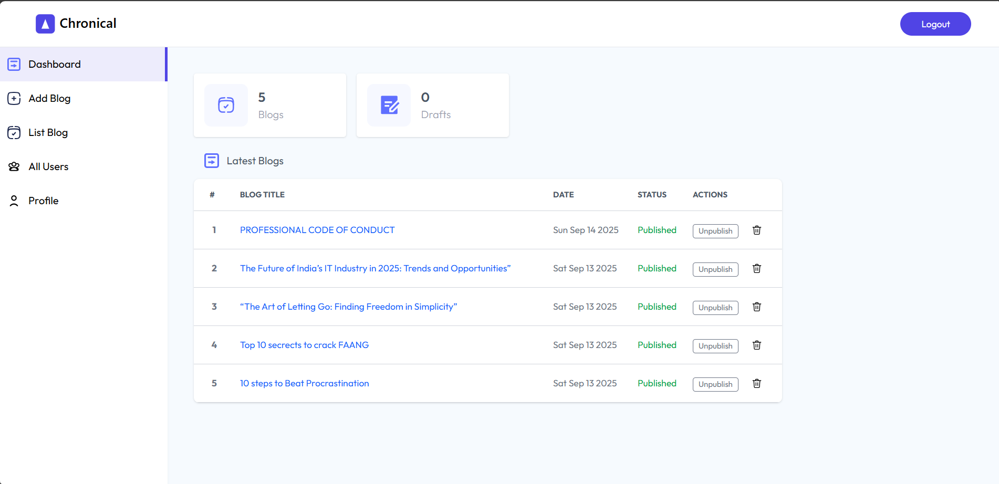
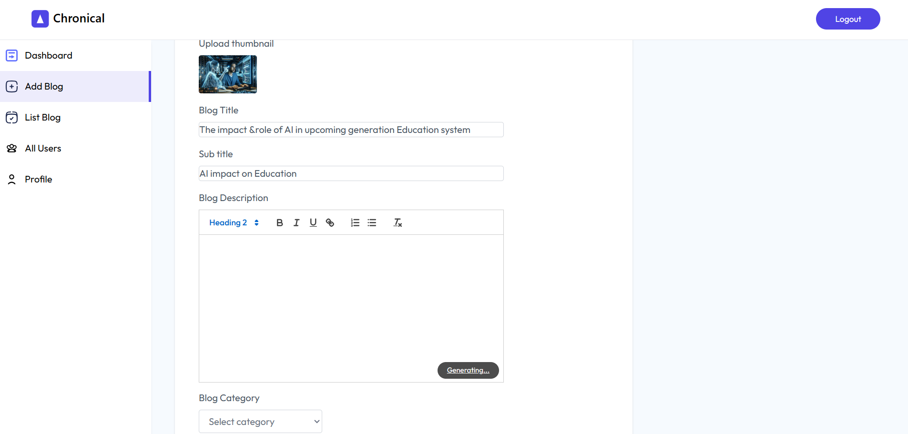
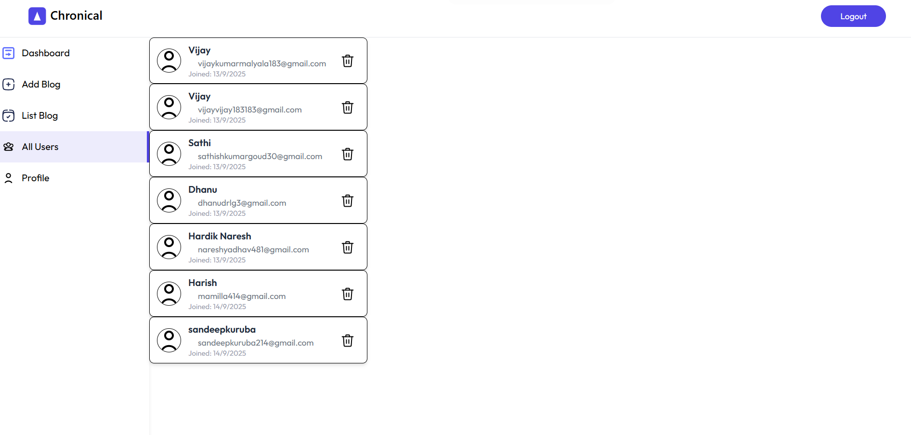

Chronical: 📝 A Blog Application (MERN Stack)

A modern MERN-based blog platform with user authentication, admin moderation, and AI-powered blog description generation.

🚀 Live Demo

  vercel: [](https://chronical-gjy2.vercel.app)


## 📸 Screenshots
  
  
  
  
  


✨ Features

👤 Users:

  Register with OTP verification & login
  Upload profile photo
  Create blogs with:
  Thumbnail upload
  AI-generated description (Gemini API)
  Comment on blogs
  Delete own blogs
  Blogs go for admin review before publishing

🛠️ Admin

user features +
View all users
Delete users, blogs, and comments
Approve / unpublish blogs

⚙️ Tech Stack
Frontend: React 19, Vite, TailwindCSS, Zustand, Quill, ImageKit
Backend: Node.js, Express, MongoDB, JWT, Multer, Nodemailer, Gemini API


```
quick start
# Clone repo
  git clone https://github.com/yourusername/blog-app.git
  
  # Install client & server
  cd client && npm install
  cd ../server && npm install
  
  # Run backend
  cd server && npm run server
  
  # Run frontend
  cd client && npm run dev
  
  

